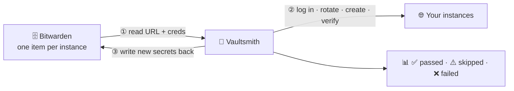

# 🔨 Vaultsmith

**Forge new credentials. Hammer out the drift.**
Rotate, create and audit credentials across dozens of instances — with your
[Bitwarden](https://bitwarden.com) vault as the single source of truth.


> Independent open-source project; not affiliated with Bitwarden Inc. It drives the official `bw` CLI.

## Why

One service account becomes forty. The password lives in the vault, a runbook, a CI
secret, someone's DM. Rotation is on the policy and nobody runs it — because doing
it *safely* means changing the password on every instance, writing every new value
back, and proving each account still logs in. Miss one and you've locked yourself
out of production.

Bitwarden's CLI is a great single-vault tool, but it has no verb for *"rotate this
across all 40 instances, write it back, and confirm it works."* Vaultsmith is that verb.



## Commands

| Command | What it does |
|---|---|
| 🔁 `change-passwords` | Rotate passwords in bulk and write the new ones back to Bitwarden |
| 👤 `create-users` | Provision a standard user (generated password) on many instances, grant access, store the creds in Bitwarden |
| 🚦 `check-logins` | Verify stored credentials can log in |
| 🩺 `check-api-access` | Verify login **and** a follow-up authenticated call — catches "login works, API is down" |
| 🔍 `search-users` | Find specific people across all instances |
| 📥 `add-credentials` | Bulk-import credentials from JSON into Bitwarden |
| ✏️ `update-passwords` | Update vault items (password / notes / name) from JSON |

`change-passwords` and `create-users` are **dry runs** until you set
`ENABLE_PASSWORD_CHANGE=true` / `ENABLE_USER_CREATION=true`.

## Quick start

Requires Node 18+ and the [Bitwarden CLI](https://bitwarden.com/help/cli/) (`npm i -g @bitwarden/cli`).

```bash
git clone https://github.com/deepeshchang/vaultsmith.git
cd vaultsmith && npm install

cp .env.example .env          # add BW_CLIENT_ID + BW_CLIENT_SECRET (Bitwarden → Settings → Security → API Key)
mkdir -p assets && cp examples/* assets/    # then edit the files in assets/

npm run check-logins          # read-only smoke test
npm run change-passwords      # dry run
```

Every command also works as `npx vaultsmith <command>`. Instance URLs and
credentials always come from the vault items — never from config files.

## Point it at your API

Vaultsmith's defaults match one reference backend; **everything about the contract
is configuration**, not code. Every setting is documented in [`.env.example`](.env.example).

| If your API… | Set |
|---|---|
| uses other URLs | `AUTH_LOGIN_PATH`, `API_USERS_PATH`, … (nine `*_PATH` variables) |
| uses Basic auth / a JSON login body / a custom header | `AUTH_MODE=basic` \| `json` \| `header` (+ `AUTH_HEADER_NAME`, `AUTH_USERNAME_FIELD`, …) |
| returns the token elsewhere | `AUTH_TOKEN_FIELD=data.token` |
| wants Bearer / header / cookie tokens | `TOKEN_TRANSPORT=bearer` \| `header` \| `cookie` (+ `TOKEN_NAME`) |
| changes passwords differently | `CHANGE_PASSWORD_OLD_FIELD`, `…_NEW_FIELD`, `CHANGE_PASSWORD_ENCODING=plain`, `CHANGE_PASSWORD_METHOD` |
| wraps lists or names fields differently | `USERS_RESPONSE_KEY`, `USER_FIELD_*`, `GROUP_FIELD_*` |
| needs another create-user body | copy `templates/create-user.json`, set `CREATE_USER_TEMPLATE_FILE` |
| has no permissions endpoint / no regions | `ENABLE_PERMISSIONS=false` / `ENABLE_REGION_SCOPING=false` |

The default contract: log in with a base64 `user:pass` in a `form-content` header →
`access_token` in the response → sent back as `Cookie: access_token=…`.
Only `create-users`' permission grant (`serviceArea: ["all"]` over regions) is
shaped for the reference API; turn it off or adapt `grantPermissions()` in
`scripts/createusers.js` if yours differs.

## Input files

Samples for all of these are in [`examples/`](examples/); copy them to `assets/`
(gitignored). In `.txt` files, blank lines and `#` comments are ignored.

| File | Used by | Format |
|---|---|---|
| `searchadmins.txt` | `search-users` | Vault item names (instances to search), one per line |
| `searchnames.txt` | `search-users` | `First Last`, one per line; username/email variants are generated (`EMAIL_DOMAINS` for addresses) |
| `logincheckerusers.txt` | `check-logins`, `check-api-access` | Vault item names |
| `passwordchangers.txt` | `change-passwords` | Vault item names |
| `admin_accounts.txt` | `create-users` | Vault item names of admin accounts; customer label = last ` - ` segment |
| `usergroups.txt` | `create-users` | ACL group names to assign (case-insensitive) |
| `creds.json` | `add-credentials` | `[{ name, username, password, collection_ids, uris?, notes? }]` — existing names are skipped |
| `updatepasswords.json` | `update-passwords` | `[{ name, new_name?, password?, notes? }]` — vault only, no instance is touched |

`create-users` writes `assets/createdusers.json` (same shape as `creds.json`) and,
in live mode, asks before importing it into Bitwarden.

## Safety

- **Dry run first.** Mutating commands change nothing until you opt in.
- **Rotation never loses a password.** The instance is changed first; if the vault write-back then fails, it retries and saves the new password to a `0600` recovery file (`ROTATION_RECOVERY_FILE`). Ambiguous network errors during a change are never auto-retried.
- **Re-runnable.** `create-users` leaves existing users untouched; `add-credentials` skips existing items.
- **Verified.** `create-users` logs in as each new user and reads their groups before it reports success.
- **No shell, no leaks.** `bw` is called with argument arrays (never shell strings); sessions go via env, not argv; passwords come from `crypto.randomInt`; logs redact secrets; files holding passwords are written `0600`; `.env` and `assets/` are gitignored.

Vaultsmith automates cross-instance orchestration; it complements, not replaces,
a secrets-management strategy. Plaintext passwords necessarily pass through process
memory, the default `serviceArea: ["all"]` grant is broad (narrow it for production),
and there's no tamper-evident audit trail — capture that separately if you need
one. Report vulnerabilities privately — see [SECURITY.md](SECURITY.md).

## Contributing

Trunk-based: small PRs (or direct pushes for maintainers) into `main`.

```bash
npm run check    # eslint + 44 tests (unit + end-to-end against a fake `bw` and mock API)
```

CI runs the same on Node 18/20/22. Conventions: plain CommonJS, one dependency
(`dotenv`); all instance I/O in `lib/api.js` and all `bw` calls in
`lib/bitwarden.js`; request/response *shape* belongs in config, not code; test
against staging in dry-run mode and never commit real credentials.

Most valuable contributions: a documented `.env` mapping (and template) for another
backend, new verification checks in the spirit of `check-api-access`, and more auth
flows (OAuth client-credentials, token refresh). Found a backend that won't fit?
Open an issue describing its login, user-list and change-password calls.

## License

[GPL-3.0](LICENSE)
